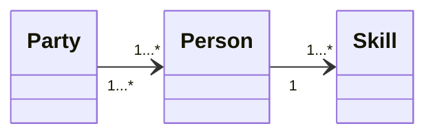

# SpringBoot ManyToMany - ManyToOne example (Party - Person - Skill)

## Description
This repository contains an SpringBoot example of entity - relationship of many-to-many, using the bidirectional relationship between Party and Person, and the unidirectional relationship between Person and Skill.

## Technologies
SpringBoot, Java, Maven, Postman, Swagger-UI, Git, Markdown, MySQL

## Execution
1. Create .env file with the following content:
```env
DB_URL=jdbc:mysql://localhost:3306/<database_name>
DB_USERNAME=<database_username>
DB_PASSWORD=<database_password>
```
2. From IntelliJ IDEA: run "Application" class.
3. Import SpringBoot.postman_collection.json to Postman or use Swagger-UI.

## API
### Endpoints
| Entity      | Method | Endpoint                       | Description           |
|-------------|--------|--------------------------------|-----------------------|
| Party       | GET    | /api/parties                   | Get all parties       |
| Party       | GET    | /api/parties/{id}              | Get party by id       |
| Party       | GET    | /api/parties/{id}/people       | Get people by party   |
| Party       | POST   | /api/parties                   | Create party          |
| Party       | PUT    | /api/parties/{id}              | Update party          |
| Party       | DELETE | /api/parties/{id}              | Delete party          |
| Person      | GET    | /api/people                    | Get all people        |
| Person      | GET    | /api/people/{id}               | Get person by id      |
| Person      | GET    | /api/people/{id}/parties       | Get parties by person |
| Person      | POST   | /api/people                    | Create person         |
| Person      | PUT    | /api/people/{id}               | Update person         |
| Person      | DELETE | /api/people/{id}               | Delete person         |
| Skill       | GET    | /api/skills                    | Get all skills        |
| Skill       | GET    | /api/skills/{id}               | Get skill by id       |
| Skill       | GET    | /api/skills/{id}/person        | Get person by skill   |
| Skill       | POST   | /api/skills                    | Create skill          |
| Skill       | PUT    | /api/skills/{id}               | Update skill          |
| Skill       | DELETE | /api/skills/{id}               | Delete skill          |
| Join        | GET    | /api/joins                     | Get all joins         |
| Join        | POST   | /api/{personId}/join/{partyId} | Create join           |
| Join        | DELETE | /api/{personId}/join/{partyId} | Delete join           |

### Swagger-UI
[Request List](http://localhost:8080/swagger-ui.html)
- ⚠️Watch out! For pageable requests, it is necessary to remove the parameter <code>"sort": ["string"]</code> .⚠️

## Tree structure:
```batch
...
├── src
│   └── main
│       ├── java
│       │   └── zzz.master.REST.party.MTM
│       │       ├── Controllers
│       │       │   ├── JoinController.java
│       │       │   ├── PartyController.java
│       │       │   ├── PersonController.java
│       │       │   └── SkillController.java
│       │       ├── Entities
│       │       │   ├── LevelEntity.java
│       │       │   ├── PartyEntity.java
│       │       │   ├── PersonEntity.java
│       │       │   └── SkillEntity.java
│       │       ├── Repositories
│       │       │   ├── PartyRepository.java
│       │       │   ├── PersonRepository.java
│       │       │   └── SkillRepository.java
│       │       └── Application.java
│       └── resources
│           └── application.properties
├── .env
├── pom.xml
├── README.md
└── SpringBoot.postman_collection.json
```

## Relation
